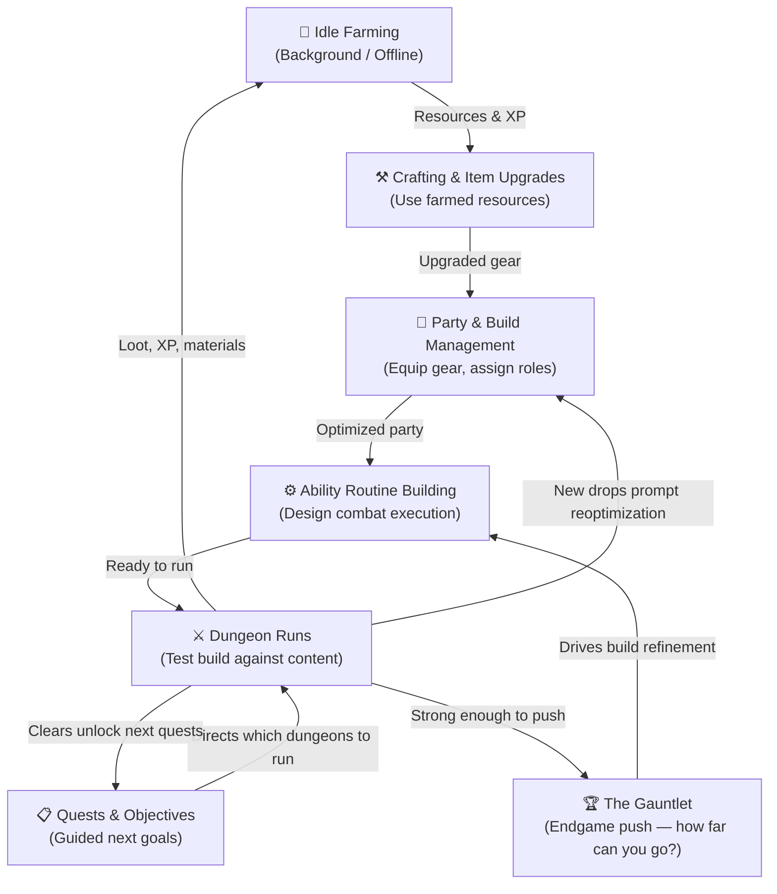

# Core Gameplay Loop

**ISYAIDLE-6 Deliverable**  
*Diagram and explanation of the gameplay loop.*

---

## Loop Diagram

> **Note:** Idle farming runs as a parallel background track at all times — it doesn't pause when the player is actively running dungeons or tuning builds. It is the always-on resource engine that keeps every other system fed.

---

## Major Gameplay Activities

### 1. Idle Farming *(Parallel Track)*
The party automatically farms enemies in a designated zone while the player is away or engaged in other activities. This generates the raw materials — experience, gold, crafting components — that fuel the rest of the loop. Progress never fully stops.

### 2. Crafting & Item Upgrades
Farmed resources are spent to craft new gear or enhance existing equipment. Crafting translates passive farming output into tangible power gains and provides a meaningful decision layer: what to craft, what to upgrade, and what to save for later.

### 3. Party & Build Management
New gear triggers a return to the build screen. Players assign equipment across party members, adjust roles, and consider synergies between characters. This is where the strategic layer begins — party composition is a puzzle with many valid solutions.

### 4. Ability Routine Building
Each character's combat behavior is defined by an ability routine the player configures. This is where execution strategy lives: the order of abilities, conditionals, timing decisions. A great routine can make a weaker party punch far above its weight. A poor routine wastes a powerful build. This system is the core strategic differentiator.

### 5. Dungeon Runs
The party enters a dungeon and the routine executes. The player watches how their strategy performs, identifies what's working and what isn't, and collects loot. Dungeon difficulty scales with zone progression. Clears yield gear, materials, and quest completions — feeding back into every upstream system.

### 6. Quests & Objectives
Structured objectives give players a clear sense of direction at all times. Quests point toward specific dungeons, milestones, or build goals, ensuring the loop never feels aimless. They serve as the guided path through content without being restrictive — players always know what to do next, but are free to deviate.

---

## The Progression Sequence

Early game establishes the loop:

**Idle farm → craft basic gear → build first party → design first routines → run starter dungeons → unlock new zones → repeat with better gear**

Mid game deepens the strategy:

**Harder dungeons demand better compositions → new abilities unlock routine complexity → crafting paths diverge → synergy hunting begins**

Endgame shifts the goal from "getting stronger" to "how strong can I get":

**The Gauntlet unlocks → players push builds against escalating difficulty → broken ability combos are discovered and refined → mastery becomes the reward**

---

## The Gauntlet *(Endgame Push Mode)*

Inspired by challenge modes in ARPGs like Diablo 4's "The Pit," The Gauntlet is an endgame zone where difficulty scales infinitely. There is no finish line — only a personal ceiling to push through.

The Gauntlet is where the game's depth fully surfaces. Clearing it requires more than good gear — it demands optimized routines, strong synergies, and the ability to find combinations of skills and abilities that interact in powerful, sometimes unexpected ways. Players who discover and execute on these combinations can push significantly further than the average progression path would suggest.

This system rewards mastery over time investment, and gives veteran players a long-term obsession even after the gear treadmill plateaus.

> **Design note:** The Gauntlet requires careful balancing as development continues. DPS ceiling mechanics need to be weighed against strategic depth — raw damage output should not be the only axis of success.

---

## Loop Summary

Isya Idle's loop is designed so that every activity feeds every other activity. Idle farming never wastes. Crafting is always relevant. Routine tuning never stops mattering. And at the top of the pyramid, The Gauntlet gives players an aspirational goal that rewards the deepest expression of their mastery.

The loop answers the player fantasy directly: come back to optimize, discover something powerful, push further than before.
